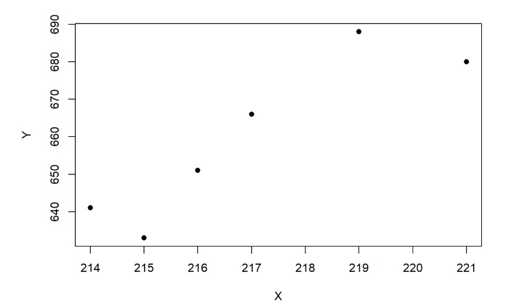

# Statistical-methods

## 1) Examining the Central Limit Theorem in Poisson and Chi-Square Distributions

##  1.1) Poisson distribution with parameter 2

As shown in the graphs below, in the case of 200 repetitions, the histogram is relatively spread out because the number of repetitions is low, and the distribution of the means is not yet fully normal.

In the second case, with 2000 repetitions, the histogram becomes more bell-shaped compared to the first case. The fluctuations are smaller, and the overall shape is closer to a normal distribution.

In the third case, with 20000 repetitions, the histogram becomes completely symmetric and bell-shaped, clearly resembling a normal distribution—exactly what the Central Limit Theorem predicts.

---
```R
n1 = 20
parametr = 2
par(mfrow = c(1, 3))  
#-------------------------------------------------------------------------------
rep11 = 200
means11 = numeric(rep11)

for (i in 1:rep11) {
  sample11 = rchisq(n1, parametr)
  means11[i] = mean(sample11)}

hist(means11, col = "skyblue", probability = TRUE,
     main = "rep = 200", xlab = "Average of samples")

curve(dnorm(x, mean = mean(means11), sd = sd(means11)),
      col = "red", lwd = 2, add = TRUE)
#-------------------------------------------------------------------------------
rep12 = 2000
means12 = numeric(rep12)

for (i in 1:rep12) {
  sample12 = rchisq(n1, parametr)
  means12[i] = mean(sample12)}

hist(means12, col = "skyblue", probability = TRUE,
     main = "rep = 2000", xlab = "Average of samples")

curve(dnorm(x, mean = mean(means12), sd = sd(means12)),
      col = "red", lwd = 2, add = TRUE)
#-------------------------------------------------------------------------------
rep13 = 20000
means13 = numeric(rep13)

for (i in 1:rep13) {
  sample13 = rchisq(n1, parametr)
  means13[i] = mean(sample13)}

hist(means13, col = "skyblue", probability = TRUE,
     main = "rep = 20000", xlab = "Average of samples")

curve(dnorm(x, mean = mean(means13), sd = sd(means13)),
      col = "red", lwd = 2, add = TRUE)
```


---

## 1.2) Chi-Square Distribution with 10 Degrees of Freedom

In the first case, with 200 repetitions, the histogram is relatively uneven, and the number of repetitions is low, so the sample mean has not yet approached normality.

In the second case, with 2000 repetitions, the histogram has become slightly more symmetric, and the normal curve fits the data better.

In the third case, with 20000 repetitions, we can see that there are many sample means, and the histogram has become almost normal in shape, thus confirming the Central Limit Theorem.

---

```R
n3 = 30
lambda = 3

par(mfrow = c(2, 3)) 

#-------------------------------------------------------------------------------
rep31 = 100
means31 = numeric(rep31)
medians31 = numeric(rep31)

for (i in 1:rep31) {
  sample31 = rexp(n3, rate = lambda)
  means31[i] = mean(sample31)
  medians31[i] = median(sample31)}

hist(means31, col = "lightblue", main = "Mean , rep = 100")
hist(medians31, col = "lightblue", main = "Median , rep = 100")

#-------------------------------------------------------------------------------
rep32 = 1000
means32 = numeric(rep32)
medians32 = numeric(rep32)

for (i in 1:rep32) {
  sample32 = rexp(n3, rate = lambda)
  means32[i] = mean(sample32)
  medians32[i] = median(sample32)}

hist(means32, col = "lightgreen", main = "Mean , rep = 1000")
hist(medians32, col = "lightgreen", main = "Median , rep = 1000")

#-------------------------------------------------------------------------------
rep33 = 10000
means33 = numeric(rep33)
medians33 = numeric(rep33)

for (i in 1:rep33) {
  sample33 = rexp(n3, rate = lambda)
  means33[i] = mean(sample33)
  medians33[i] = median(sample33)}

hist(means33, col = "lightyellow", main = "Mean , rep = 10000")
hist(medians33, col = "lightyellow", main = "Median , rep = 10000")
```


---

## 2) 95% confidence interval for the sample_data

```R
CI = function(data) {
  n_CI = length(data)
  x_bar = mean(data)
  sigma = 25
  z = 1.96  
  se = sigma / sqrt(n_CI)
  lower = x_bar - z * se
  upper = x_bar + z * se
  return(c(lower, upper))}

sample_data = c(70,78,80,69,81,75,71,83,90,77,88,74,89,67,85)
CI(sample_data)
```

```text
Upper bound: 91.11841
Lower bound: 65.81492
```

---

## 3) One-sample t-test
If the test statistic is greater than the critical value, the null hypothesis is rejected and the mean is less than 52. If the test statistic is smaller, then the null hypothesis is not rejected and the mean is not less than 52.

Here, the null hypothesis is `rejected` and the mean is less than 52.

```R
weights4 = c(52, 48, 47, 53, 58, 56, 53, 49, 48, 50)
n4 = 10
x_bar4 = mean(weights4)
s = sd(weights4)
mu = 52 

(t = (x_bar4 - mu) / (s / sqrt(n4)))
```
```text
test statistic: -0.5187514
```

```R
(t_critical = qt(0.05, df = n4 - 1))
```
```text
critical value: -1.833113
```

---

## 4) Cattle Weight Prediction

The dependent variable is the one we aim to predict or model, and the independent variable is the one that affects the dependent variable or is used to predict it.

In this example, hand girth (independent variable) can be used to predict the weight of the cattle (dependent variable).

X: Cattle hand girth

Y: Cattle weight

```R
Y = c(641, 633, 651, 666, 688, 680)
X = c(214, 215, 216, 217, 219, 221)

plot(X,Y,col = "black" , pch =16)
cor(X,Y)
```

Since the correlation is close to one, it indicates a strong correlation between the cattle’s weight and heart girth.

```text
correlation: 0.8978956
```



